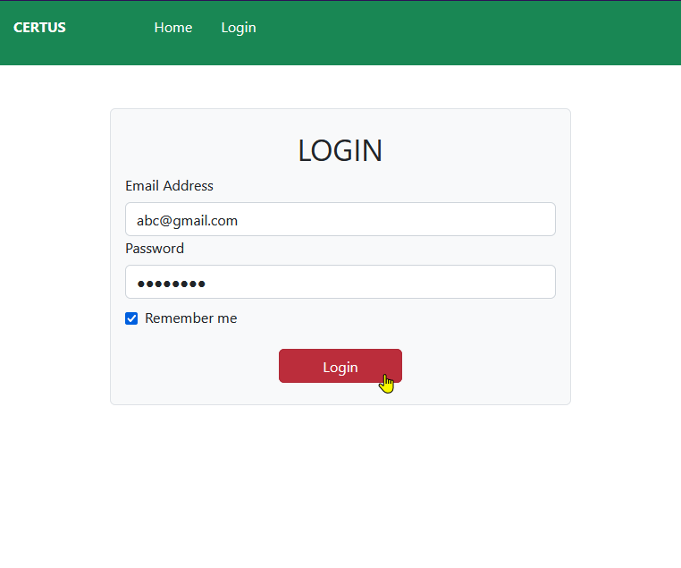
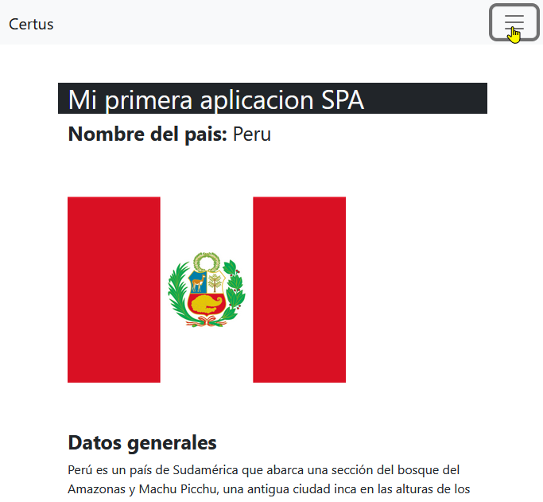
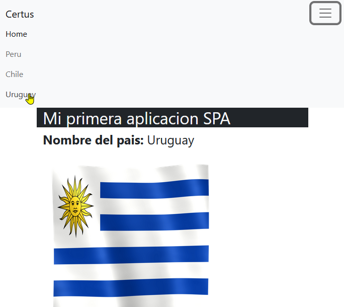

# Taller16

Reto:

At. asíncrona

Existen:
- las rutas simples
- las rutas con parámetros (en las que se agrega el parámetro al url /1234567(id) /q?=abc)

tener instalado e importado routerModule
dentro del app-routing-module.ts colocamos la lista de rutas

(si no lo agregaste al generar el proyecto : ng generate module app-routing --flat --module=app)